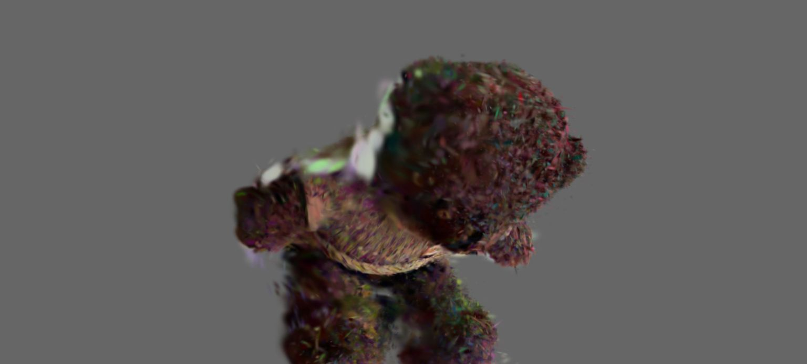
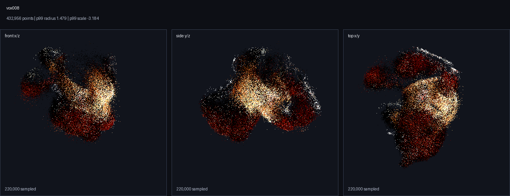

# SR 3DGS Pipeline

面向手机视频和图片集合的单物体 3D Gaussian Splatting 交付流水线。

[English](README.md) | [日本語](README.ja.md)



SR 3DGS Pipeline 集成拍摄准备、帧筛选、COLMAP 相机重建、gsplat 训练、
Gaussian 清理和 Web 交付打包。项目主要面向静态物体重建，例如商品、收藏品、桌面物体、玩具和小型扫描资产。

本仓库是基于成熟开源组件构建的 alpha 阶段工程流水线，不是新的 3DGS 研究方法。输出质量取决于拍摄覆盖、清晰度、光照、物体纹理和场景稳定性。

## 功能

- 支持手机视频和图片文件夹输入。
- 支持 perspective 和 equirectangular 抽帧。
- 基于 COLMAP 的相机重建。
- gsplat 训练入口。
- 可选物体裁剪、自动 mask 和 mask-aware training。
- 自动清理离散团块、漂浮点和低置信度雾状 splat。
- 生成扁平的 `output/<scene>/` 交付目录。
- 导出适合 Web 和移动端预览的 PlayCanvas SOG。
- 导出适合 SuperSplat 和后续工具链的标准 PLY。
- 为抽帧和 mask 生成输入质量报告。
- 提供 CI 安全检查、输出验证、交付评分和本地 HTTP 预览烟测。

## 示例

仓库包含当前物体示例的轻量预览图。PLY、SOG、视频和重建工作区等大型生成资产不纳入 git。



发布目录结构：

```text
output/<scene>/
  START_HERE.html
  preview.html
  <scene>_v<timestamp>.sog
  <scene>_high_quality.ply
  diagnostics.json
  manifest.json
```

SOG 文件名包含时间戳，用于降低重复发布时的浏览器缓存风险。

## 输入要求

推荐拍摄条件：

- 单个主要静态主体
- 20-60 秒缓慢环绕手机视频，或 40-180 张可用静态图片
- 围绕主体的充分角度覆盖
- 可选的低、中、高三个相机高度层
- 稳定曝光和光照
- 背景与主体在视觉上可区分
- 尽量减少运动模糊、反射、透明材质和形变

活体或可形变主体不属于主要目标场景，除非拍摄过程中基本保持静止。

更多说明见 [docs/CAPTURE_GUIDE.md](docs/CAPTURE_GUIDE.md)。

## 安装

基础安装：

```bash
python -m venv .venv
source .venv/bin/activate
pip install -e .
pip install -r requirements.txt
```

训练依赖：

```bash
pip install -e ".[training]"
```

可选 mask 依赖：

```bash
pip install -r requirements-optional.txt
```

后端检查：

```bash
python scripts/check_backend.py
```

## 从视频运行

```bash
python scripts/run_video_pipeline.py \
  --video input_videos/object.mp4 \
  --output_name object \
  --projection perspective \
  --preset standard \
  --object_mask auto \
  --cluster_clean
```

超分是可选项。默认 `standard` preset 是几何优先流程，会保留抽取帧的原始分辨率。只有在输入足够清晰、显存足够时，才建议启用 learned SR：

```bash
# 不使用 learned SR；速度最快，也最不容易引入虚构纹理。
python scripts/run_video_pipeline.py --video input_videos/object.mp4 \
  --preset standard --sr_mode off --sr_scale 1

# 用确定性的 Lanczos 放大，适合做对照实验。
python scripts/run_video_pipeline.py --video input_videos/object.mp4 \
  --preset standard --sr_mode resize --sr_scale 2

# 训练前启用 learned SR。
python scripts/run_video_pipeline.py --video input_videos/object.mp4 \
  --preset quality --sr_mode model --sr_model real-esrgan --sr_scale 2
```

每次运行都会写入 `workspace_video/<scene>/sr_images/sr_manifest.json`，记录本次 SR 模式、scale、输出分辨率和 fallback 状态。learned SR 带有加载和进度超时；如果模型无法加载或长时间没有产出，pipeline 会回退到原始分辨率帧，并在 manifest 中记录 `effective_mode`、`effective_scale` 和 `model_preflight`。设置 `--sr_strict_model` 可将 learned SR 失败作为错误处理，而不是自动回退。在 `--sr_mode auto` 中，只有权重已经在本地时才会自动选择 learned SR；设置 `--sr_allow_download` 可允许首次运行时下载权重。

可选物体裁剪：

```bash
--object_bbox left,top,right,bottom
```

Equirectangular 视频：

```bash
python scripts/run_video_pipeline.py \
  --video input_videos/object_360.mp4 \
  --output_name object_360 \
  --projection equirectangular \
  --equirect_face_size 1024 \
  --equirect_faces front,right,back,left \
  --object_mask auto \
  --cluster_clean
```

## 输入评估

```bash
python scripts/assess_scene_inputs.py workspace_video/object \
  --report workspace_video/object/reports/input_quality.json \
  --html workspace_video/object/reports/input_quality.html
```

`run_video_pipeline.py` 还会写入：

- `workspace_video/<scene>/reports/input_quality_frames.html`
- 启用 `--object_mask auto` 时的 `workspace_video/<scene>/reports/input_quality_object.html`

评估内容包括帧数、模糊、近重复视角、大幅视角跳变、前景 mask 大小和 mask 是否触碰图像边界。

## 验证和预览

```bash
python scripts/validate_output.py output/object
python scripts/score_output.py output/object
python scripts/http_preview_smoke.py output/object
python scripts/serve_output.py --scene object --port 8765
```

本地预览地址：

```text
http://127.0.0.1:8765/output/object/START_HERE.html
```

浏览器加载 SOG 需要本地 HTTP 服务；直接通过 `file://` 打开预览页并不可靠。

## 清理工具

- `scripts/cluster_clean_ply.py`：主连通分量过滤。
- `scripts/filter_ply_confidence.py`：低置信度 splat 过滤。
- `scripts/crop_ply_by_core.py`：基于高置信度核心的候选生成。
- `scripts/compare_clean_candidates.py`：候选指标比较。
- `scripts/render_ply_contact_sheet.py`：用于目检的 CPU contact sheet 渲染。

清理模块用于降低常见重建伪影，但不能替代充分的相机覆盖、清晰输入帧、稳定光照和静态场景几何。

## 仓库检查

```bash
PYTHONDONTWRITEBYTECODE=1 python scripts/ci_check.py
PYTHONDONTWRITEBYTECODE=1 python scripts/release_readiness.py
PYTHONDONTWRITEBYTECODE=1 python scripts/release_readiness.py --include_output
```

生成的重建资产不纳入版本控制。仓库跟踪源码、配置、文档、测试和轻量预览图。

## 状态

已实现：

- 视频和图片文件夹编排
- perspective 和 equirectangular 抽帧
- COLMAP/pycolmap 相机准备
- gsplat 训练入口
- 标准 PLY 导出
- PlayCanvas SOG viewer 导出
- 物体裁剪和 mask-aware training hook
- Gaussian 自动清理工具
- 输入质量报告
- 输出验证和本地 HTTP 预览检查

计划改进：

- 更广泛的公开 benchmark 场景
- 更强的分割后端
- 覆盖更多拍摄设备的默认参数
- 面向专用机器的可选视觉 QA 工作流

## 相关项目

- [COLMAP](https://colmap.github.io/)
- [gsplat](https://github.com/nerfstudio-project/gsplat)
- [Nerfstudio / Splatfacto](https://docs.nerf.studio/)
- [PlayCanvas SuperSplat and SOG tooling](https://github.com/playcanvas)

项目定位见 [docs/PROJECT_POSITIONING.md](docs/PROJECT_POSITIONING.md)。

## 贡献

欢迎贡献公开测试素材、清理方法、分割后端、benchmark 场景和文档。

见 [CONTRIBUTING.md](CONTRIBUTING.md)。

## License

MIT. See [LICENSE](LICENSE).
